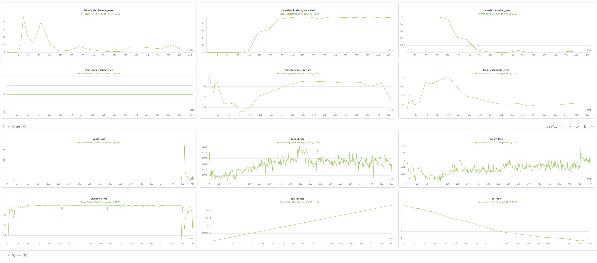
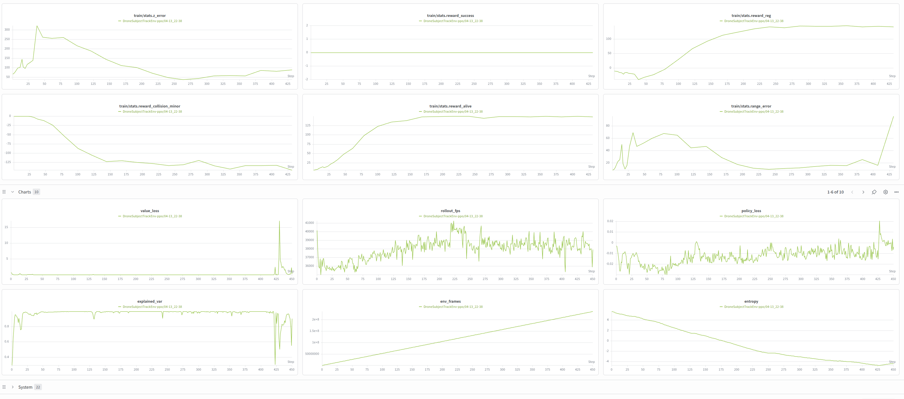

# Codding Challenge


*Isaac Sim visualization of the learned obstacle-avoidance policy.*

**The green dot is the desired drone position, the blue dot is the drone, the yellow dot is the subject, and red is the obstacle**


*Trajectory plots across three example scenarios. Interactive Plotly HTML files for these visualizations are saved in the `scripts/` folder.*

**Training Results**


## Getting Started (Docker)

### 1. Clone the Repository

```bash
mkdir omni_drones   # parent directory must be named exactly 'omni_drones'
cd omni_drones
git clone git@github.com:mrunaljsarvaiya/coding_challenge_rl.git
cd OmniDrones
git submodule update --init --recursive
```

> **Note:** The parent directory must be named `omni_drones` and the repo cloned inside it as `OmniDrones`, giving the path `…/omni_drones/OmniDrones`. This is a known limitation that will be fixed in a future release.

### 2. Configure Your Shell

Add the following to your `~/.bashrc` on the host machine:

```bash
export OMNI_DRONES_DIR=/absolute/path/to/omni_drones/OmniDrones   # e.g. $HOME/omni_drones/OmniDrones
source $OMNI_DRONES_DIR/helpers
```

Then reload your shell:

```bash
source ~/.bashrc
```

### 3. Pull the Docker Image

```bash
docker_pull_omni
```

### 4. Enter the Docker Container

```bash
docker_run_omni
```

This opens an interactive shell inside the container. Your repo is mounted at `/workspace/omni_drones`.

### 5. Install OmniDrones (first time only)

Inside the container:

```bash
omni_drones_install
```

This installs Isaac Sim dependencies and the OmniDrones package. Expect some harmless pip resolver warnings. Re-source the shell when prompted (`source ~/.bashrc`).

### 6. Run the Demo

Inside the container:

```bash
play_obs_avoidance
```

Runs a pretrained obstacle-avoidance policy for one episode. The raw Plotly HTML file is saved to `scripts/play_trajectory.html` (and also as `scripts/play_trajectory_<index>.html` when a scenario index is passed).

Optionally pass a scenario index (0–4) to select different flight parameters:

```bash
play_obs_avoidance 2
```

### 7. Visualize Results

Inside the container:

```bash
viz_trajectory
```

Then open your browser to **http://localhost:8080/play_trajectory.html**.

### Training (Optional)

To train from scratch inside the container:

```bash
train_obs_avoidance
```

Set `WANDB_API_KEY` in your host environment before running `docker_run_omni` to enable Weights & Biases logging automatically.

### Pretrained Checkpoint

A pretrained `checkpoint.pt` is already included in the repository at `checkpoint.pt`. The `play_obs_avoidance` command loads it automatically — no training required to run the demo.

---
